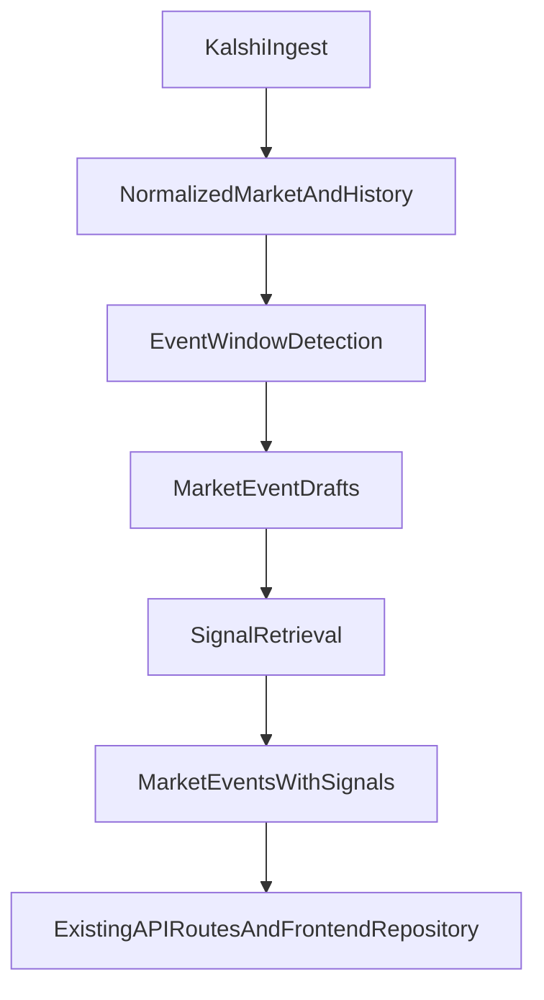

# Backend Build Plan

## Assessment

The repo is already past the earliest "introduce FastAPI" step.

- The backend scaffold exists in [backend/app/main.py](backend/app/main.py), [backend/app/api/routes.py](backend/app/api/routes.py), and [backend/app/services/markets.py](backend/app/services/markets.py).
- The frontend is already reading through the repository boundary in [frontend/lib/repositories/markets.ts](frontend/lib/repositories/markets.ts).
- The frontend and backend contracts are already closely aligned in [frontend/lib/market-types.ts](frontend/lib/market-types.ts) and [backend/app/models/market.py](backend/app/models/market.py).
- The remaining missing work is not basic API wiring; it is the real backend engine under the existing contract.

Because of that, your proposed three tickets are directionally correct, but they map more closely to the "core engine" work described after the initial FastAPI scaffold rather than to the earliest Phase 3 setup.

## Recommendation

Treat the next implementation slice as:

1. `backend/app/services/kalshi/`: ingest raw Kalshi market + history data and normalize it into the existing market contract.
2. `backend/app/services/events/`: detect deterministic event windows from normalized historical price movement, then filter and cap them before enrichment.
3. `backend/app/services/signals/`: retrieve candidate sources for each detected window and attach scored `Signal` records to the resulting `MarketEvent`.

This is the right sequence because each step produces the input required by the next:

## Kalshi Data Surface

Plan from the data Kalshi actually exposes, then derive the higher-level product behavior from that.

- Use REST as the canonical layer for market catalog sync, historical backfill, replay, and recovery after disconnects.
- Use Kalshi market endpoints for market metadata and filtering, and candlestick endpoints for time-series history.
- Treat Kalshi exchange `event` objects as provider metadata and grouping, not as the same thing as our product-level `MarketEvent`.
- Use websockets for freshness and triggering only, not as the sole source of truth for history reconstruction.

Practical interpretation:

- REST provides the inputs needed to recompute state deterministically.
- Websocket channels provide low-latency signals that a market may need re-evaluation.
- Our backend remains responsible for producing the final `MarketEvent` objects the UI consumes.

## Persistence And Retrieval Strategy

Do not use object storage alone as the primary system of record.

Recommended architecture:

- Use a relational database as the canonical operational store.
- Use object storage for immutable or large raw artifacts.
- Prepare for vector search by keeping canonical source documents and chunk metadata in the database from day one, while deferring any dedicated vector-database decision until retrieval and indexing become a real workload.

Recommended default:

- Supabase as the default hosted Postgres platform.
- Supabase Storage can support the earliest phase if needed, but Amazon S3 is the planned blob store for durable raw artifacts and larger source captures.
- Use Supabase's Postgres foundation as the canonical source of truth for normalized data, source metadata, chunk metadata, and processing state.
- Treat vector search as a staged capability:
  - start with a relational-first corpus model in Supabase
  - allow `pgvector` in Supabase as the simplest first indexing path if lightweight semantic retrieval is needed early
  - revisit a dedicated vector database later if indexing scale, retrieval throughput, or filtering complexity materially outgrow that setup

Why this is the best fit:

- We need reproducible, queryable state across markets, candles, detected events, signals, and research runs.
- Hosted infrastructure keeps operational complexity low and helps get the backend online faster than self-hosting multiple systems.
- We will need joins, filters, idempotency, versioning, and backfills long before we need a separate specialized vector database.
- Supabase docs explicitly position Postgres and pgvector as a practical default for AI and vector workloads, especially for simple or single-database workloads, with the option to split collections later as usage grows.
- Amazon S3 remains valuable as a blob store referenced by database records, not as the only persistence layer.

Avoid:

- S3-only storage with no canonical relational index.
- Prematurely introducing a separate vector database before the retrieval layer and corpus shape are stable.
- A design where embeddings are introduced later without preserving chunk IDs, source versions, and provenance metadata now.

What should live in Supabase Postgres:

- normalized markets and market metadata
- normalized candle or time-series records
- detected event windows
- signal metadata and attachment records
- source document metadata, chunk metadata, provenance, and processing status
- research run logs, routing decisions, and enrichment job state
- optional embedding rows for semantic retrieval if the first retrieval pass is kept inside Supabase

What should live in Amazon S3:

- raw Kalshi payload archives for replay or audit
- fetched article HTML or rendered page captures
- extracted full-text source snapshots
- large intermediate artifacts that are expensive to keep inline in relational tables

Operational rule:

- Every object-storage artifact should have a database record with checksum, source URL, capture time, parser version, and owning entity ID.
- Every embedding should point back to a stable canonical chunk or source-document row.
- Reproducibility depends on versioned source records, not only on stored vectors.

Infrastructure decision for this phase:

- Default to hosted services over self-hosting.
- Start with Supabase as the database platform because it minimizes setup friction while still preserving a clean Postgres-based architecture.
- Use Amazon S3 for blob storage and raw artifact retention.
- Do not commit to a dedicated vector database yet; add that only when retrieval and indexing requirements are concrete enough to justify the extra system.

## Live Data Strategy

Use websocket data to wake up the system, but not to replace the deterministic pipeline.

- Primary live trigger: Kalshi `ticker` channel for price, bid/ask, volume, open interest, and timestamps.
- Secondary confirmation channel: Kalshi `trade` for actual executed trade activity.
- Lifecycle channel: use `market_lifecycle_v2` for catalog freshness, status changes, and settlement updates.
- Defer `orderbook_delta` to a later phase unless microstructure-aware triggers become necessary.

Rule:

- A websocket message should not directly trigger research.
- It should first trigger local state updates and deterministic event-candidate evaluation.
- Only once a candidate event window exists should the system consider enrichment or external research.
- Do not make websockets part of the first debugging loop; get the REST ingestion and polling path working first, then layer websocket freshness triggers on top of the same normalized update interface.

## Rollout Constraint

Keep the first rollout intentionally narrow so debugging and quality checks stay manageable.

- Start with a configurable top-`N` market subset rather than the full Kalshi universe.
- Choose the initial subset using simple operational criteria such as status plus liquidity or volume, not opaque ranking.
- Keep the subset size adjustable so the system can expand gradually once ingestion, detection, and enrichment look stable.
- Build the pipeline so the same code path works for both the initial top-`N` subset and the broader market universe later.

## Ticket 1: Kalshi Ingestion And Normalization

Build on top of [backend/app/services/markets.py](backend/app/services/markets.py) and the existing response models in [backend/app/models/market.py](backend/app/models/market.py).

Scope:

- Add a provider-specific adapter under [backend/app/services/kalshi/](backend/app/services/kalshi/) for fetching market metadata and historical observations.
- Support both live and historical Kalshi REST paths so the backend can backfill older settled markets and recent active markets through one normalized interface.
- Introduce a platform-agnostic normalized domain shape for:
  - market summary/detail fields already exposed by the API
  - historical probability/time series needed for event detection
- Lock the first-pass normalized history shape before detector implementation:
  - `timestamp`
  - `probability`
  - keep the core detection input intentionally minimal even if richer candle metadata is stored alongside it
- Normalize live websocket payloads into an internal update format that can feed incremental refresh logic without becoming the canonical store.
- Persist both normalized records and raw-source references so the ingestion pipeline can be replayed and audited later.
- Implement the first pass against REST plus polling before websocket ingestion becomes a required part of the runtime.
- Scope the first pass to a configurable top-`N` tracked market set for easier debugging and cost control.
- Keep provider logic isolated so `services/events` does not know about Kalshi response formats.
- Preserve the current route contract in [backend/app/api/routes.py](backend/app/api/routes.py); routes should continue to depend on thin service functions, not provider code.

Suggested file targets:

- [backend/app/services/kalshi/client.py](backend/app/services/kalshi/client.py)
- [backend/app/services/kalshi/normalize.py](backend/app/services/kalshi/normalize.py)
- [backend/app/services/kalshi/types.py](backend/app/services/kalshi/types.py)
- [backend/app/services/markets.py](backend/app/services/markets.py)

Exit criteria:

- A service can return normalized markets from Kalshi without changing the frontend-facing schema.
- Historical series are available in a clean internal format for downstream event detection.
- REST and websocket inputs can both be translated into a shared internal representation.
- The current mock-backed endpoints have a clear swap path to real data.
- The same ingestion run can be reproduced from persisted source artifacts and normalized records.
- The persistence model fits a hosted Supabase plus S3 deployment from the start.
- The detector input shape is locked early enough that event logic does not thrash around changing provider-specific candle fields.
- The initial runtime can be validated with REST plus polling alone before websocket support is added.

## Ticket 2: Event Detection And Filtering

Build a deterministic event detector in [backend/app/services/events/](backend/app/services/events/) that converts normalized history into `MarketEvent` candidates matching [backend/app/models/market.py](backend/app/models/market.py), then filters those candidates into a cleaner bounded event set for enrichment.

Scope:

- Define explicit event-window heuristics first, rather than ranking or opaque modeling.
- Detect windows from real history using explainable rules such as:
  - minimum move threshold
  - minimum persistence window
  - merge logic for overlapping spikes
  - direction inference from before/after movement
- Decide explicitly whether the detector keys off traded price, bid/ask midpoint, or a hybrid fallback when candles are sparse or null.
- Add debounce or cooldown behavior so repeated live updates do not create duplicate event windows or repeatedly trigger research.
- Produce event drafts with `startTime`, `endTime`, `probabilityBefore`, `probabilityAfter`, `movementPercent`, and `direction`.
- Add a post-detection filtering step before enrichment to:
  - remove weak or noisy windows
  - merge or collapse near-duplicate candidates
  - cap the number of events retained per market or evaluation cycle
- Define event idempotency rules so recomputation does not create duplicate logical events.
- Use a stable event identity that is more robust than raw exact timestamps alone:
  - event identity should be derived from `market_id` plus normalized window boundaries and detector version
  - keep a separate event revision or payload hash so the same logical event can be updated when fields shift slightly after recomputation
- Keep filtering deterministic and inspectable so the system can explain why an event was kept or discarded.
- Leave `signals`, `entities`, and `relatedEvents` empty or placeholder-populated until Ticket 3.

Suggested file targets:

- [backend/app/services/events/detector.py](backend/app/services/events/detector.py)
- [backend/app/services/events/types.py](backend/app/services/events/types.py)
- [backend/app/services/markets.py](backend/app/services/markets.py)

Exit criteria:

- Given a normalized time series, the detector returns stable and explainable event windows.
- The filtering step leaves a bounded, cleaner event set ready for enrichment rather than an uncurated list of raw candidates.
- Output can be transformed into the existing `MarketEvent` API contract without changing frontend types.
- Detection rules are testable in isolation with fixture histories.
- Live websocket updates can safely trigger re-evaluation without making the detector non-deterministic.
- Re-running detection over the same market history is idempotent at the logical-event level.

## Ticket 3: Signal Retrieval And Attachment

Add an enrichment layer under [backend/app/services/signals/](backend/app/services/signals/) that retrieves sources around detected windows and populates the existing `Signal` array on each event.

Scope:

- Use the event window as the retrieval boundary.
- Retrieve candidate sources for the market/window pair and score them for relevance.
- Map results into the existing `Signal` shape already used by the UI in [frontend/lib/market-types.ts](frontend/lib/market-types.ts) and [backend/app/models/market.py](backend/app/models/market.py).
- Introduce a lightweight routing decision before research that can choose `skip`, `light_research`, or `deep_research` based on move size, recency, market importance, and whether recent signals already exist.
- If source retrieval or downstream summarization needs a multi-step AI workflow, use LangChain for model and tool abstraction and LangGraph for stateful orchestration, retries, or branching.
- Prefer non-browser retrieval first, such as search APIs, feeds, or direct fetches; use browser automation only when the source requires interactive navigation or simpler retrieval failed.
- Define V1 retrieval constraints explicitly:
  - keep roughly `10-20` signals maximum per event
  - deduplicate near-identical or repeated source hits before attachment
  - prioritize time proximity to the event window and entity overlap with the market or event
- Store canonical source documents and chunk metadata in a form that can later be embedded and searched semantically without rethinking the whole persistence model.
- Keep the retrieval layer abstract so an initial Supabase-based search path can later coexist with or migrate to a dedicated vector database if semantic retrieval becomes a major workload.
- Defer advanced entity extraction and related-event linking until the signal pipeline is returning grounded source material reliably.

Suggested file targets:

- [backend/app/services/signals/provider.py](backend/app/services/signals/provider.py)
- [backend/app/services/signals/scoring.py](backend/app/services/signals/scoring.py)
- [backend/app/services/signals/attach.py](backend/app/services/signals/attach.py)

Exit criteria:

- Detected events are enriched with source-backed `Signal` items.
- Each signal is traceable to a source URL and timestamp.
- The enrichment step can run independently of route handlers.
- Research only runs after deterministic candidacy checks, so routine market noise does not fan out into unnecessary LLM or browser work.
- The stored source corpus is ready for later embedding and semantic retrieval with stable document and chunk identities.
- The system can begin with a hosted relational-first stack and still evolve into a dedicated retrieval architecture later.
- V1 signal output is intentionally bounded, deduplicated, and ranked by temporal and entity relevance.

## Cross-Cutting Requirements

These should be part of the implementation plan from the start, not deferred:

- Add backend tests alongside the new services under `backend/tests/`, because the repo currently has no backend test suite even though [backend/pyproject.toml](backend/pyproject.toml) is ready for `pytest`.
- Keep routes thin in [backend/app/api/routes.py](backend/app/api/routes.py); orchestration belongs in services.
- Preserve the gate in [docs/phase-gates.md](docs/phase-gates.md): shared contracts stay aligned, repository boundaries remain intact, and backend-owned aggregation stays in services.
- Prefer deterministic, inspectable logic over ranking-heavy or AI-heavy inference in the first pass.

## Idempotency Rule

Idempotency is required for ingestion, event detection, and enrichment.

- Re-running the same ingestion window should update or no-op, not duplicate rows.
- Re-running detection on the same normalized history should converge on the same logical events.
- Re-running enrichment for the same event should replace, merge, or deduplicate signals according to deterministic rules.
- Event identity should not depend only on exact raw timestamps, because small detector shifts can create accidental duplicates.
- Prefer a stable event key derived from market identity plus normalized time-window boundaries and detector version, with a separate revision hash for payload changes.

## AI Workflow Rule

Use LangChain and LangGraph selectively, not as the default abstraction for the entire backend.

- Keep `services/kalshi` and `services/events` as plain deterministic Python services. They are data normalization and rules-engine code, not agent workflows.
- Use LangChain where an AI-capable step benefits from a standard model or tool interface, especially for source processing, extraction, classification, or future grounded copilot steps.
- Use LangGraph when the workflow has an explicit pipeline with state transitions, retries, branching, persistence, or human-in-the-loop checkpoints.
- Keep the graph boundary behind backend service interfaces so the API contract in [backend/app/models/market.py](backend/app/models/market.py) does not depend directly on LangChain or LangGraph internals.
- Do not introduce LangChain or LangGraph into Ticket 1 or Ticket 2 unless a concrete AI step appears; start using them in Ticket 3 or the later grounded copilot layer.

## Research Trigger Rule

External research should be gated behind deterministic market logic.

- Websocket updates should mark markets as changed and prompt re-evaluation, not immediately launch research.
- The event detector should first decide whether a meaningful event candidate exists.
- A cheap router step may then decide whether the candidate deserves no research, light research, or deeper research.
- Browser-based research should be a fallback path, not the default enrichment path.
- The first implementation should optimize for bounded cost and explainability over maximal coverage.
- Event filtering and signal caps are part of that cost-control strategy, not optional polish.

## Semantic Search Readiness Rule

Design the persistence layer so vector search is an extension of the source corpus, not a separate reinvention later.

- Canonical source documents should be stored once with stable IDs, provenance, timestamps, and parser versions.
- Chunking should produce stable chunk IDs tied to the canonical source record.
- Embeddings should be treated as a derived index that can be regenerated, not as the only copy of meaningful content.
- Retrieval should combine semantic similarity with metadata filters such as market, event window, source type, and time range.
- The first implementation should keep this compatible with Supabase-hosted Postgres and only escalate to a dedicated vector database if retrieval scale or product needs justify it.
- This makes later semantic search, related-event lookup, and grounded copilot retrieval much easier to add without reworking the ingestion model.

## Hosted Infrastructure Rule

Bias toward managed services and low-ops defaults in the first implementation.

- Prefer Supabase over self-hosted Postgres for the initial operational database.
- Prefer Amazon S3 for raw artifact storage rather than building custom blob infrastructure.
- Keep the architecture portable so self-hosting remains possible later, but do not optimize for self-hosting now.
- Favor the fewest moving pieces needed to get the backend, persistence, and research pipeline online quickly.

## Delivery Order

Implement in this order:

1. Lock the normalized ingestion contract and history shape.
2. Lock the persistence model around Supabase Postgres plus Amazon S3, with future vector retrieval designed in from the start but a dedicated vector database deferred.
3. Validate the pipeline first with REST plus polling on a configurable top-`N` market subset.
4. Build event detection against normalized history and live updates, then add deterministic filtering and capping before enrichment.
5. Add websocket ingestion for freshness and triggering only after the REST-based foundation is behaving predictably.
6. Add research routing plus signal retrieval/enrichment on top of the filtered event set, using LangChain or LangGraph only where the workflow truly becomes AI-driven.
7. Then wire the existing market/event endpoints from mock data to the real service path incrementally.

## Conclusion

Your proposed three tickets are correct in substance.

The only adjustment I would make is semantic and structural:

- They are best treated as the next backend engine tickets on top of an already-started Phase 3 scaffold.
- Ticket 1 must explicitly include normalized historical series, or Ticket 2 will not have a stable input.
- Ticket 2 should include a post-detection filtering stage so enrichment runs on a bounded, higher-signal event set.
- The first operational rollout should use REST plus polling and a top-`N` market subset before websocket-driven expansion.
- Tests should be included as part of each ticket rather than as a separate later cleanup.
- LangChain and LangGraph should be adopted for AI-facing orchestration layers, especially signal enrichment and the later grounded copilot workflow, rather than for the deterministic ingestion and event-detection core.
- Kalshi REST should be treated as the canonical source for sync and recomputation, while websockets act as live triggers that feed deterministic evaluation before any research is launched.
- The system should adopt a hosted database-backed source of truth now, with Supabase as the default database platform and Amazon S3 for raw artifacts, rather than postponing persistence design or relying on blob storage alone.
- A dedicated vector database remains a likely later evolution if retrieval becomes central, but it should not be the default dependency for the first backend implementation.
- V1 signal retrieval should stay constrained: bounded result counts, deduplication, and simple relevance based first on time proximity and entity match.
- Event identity and idempotency need to be designed explicitly so recomputation updates existing logical events instead of creating timestamp-level duplicates.

