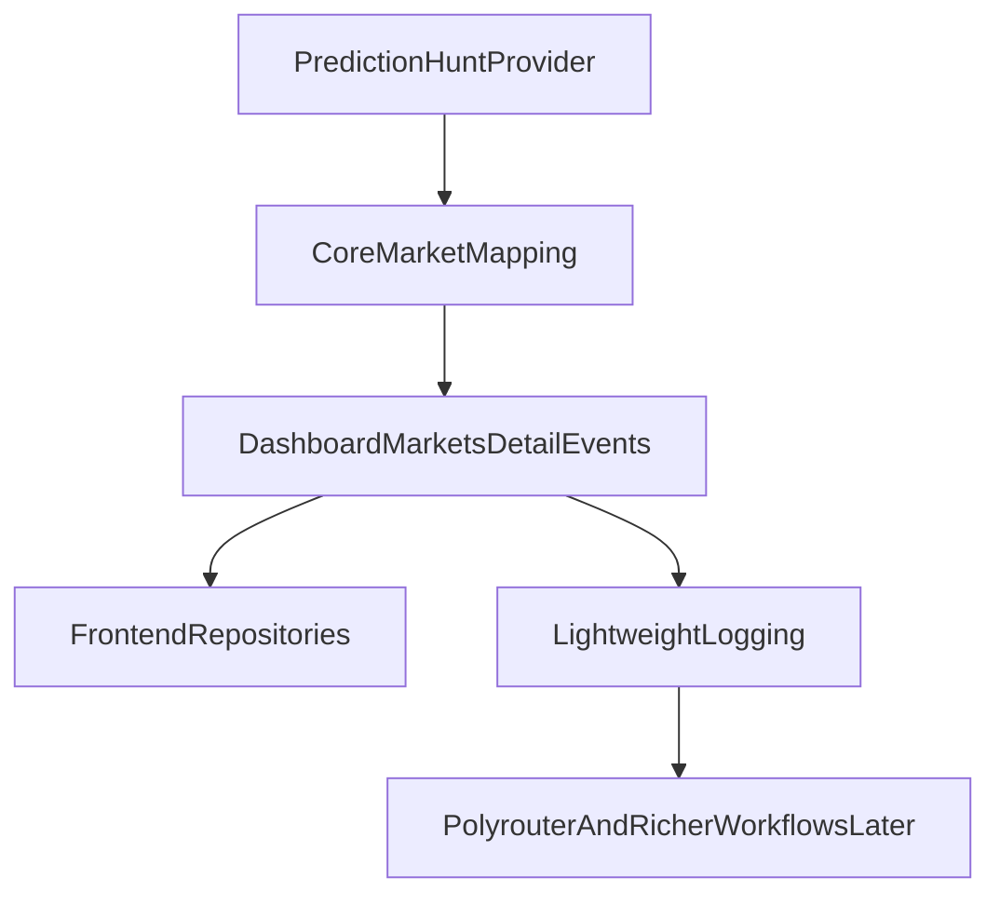

# Backend Build Plan

## Current Assessment

The backend should currently optimize for simplicity, contract stability, and debuggability rather than depth.

- The frontend already reads through `frontend/lib/repositories/markets.ts`.
- The core app contract still lives in `frontend/lib/market-types.ts` and `backend/app/models/market.py`.
- The next useful backend step is not broader provider sprawl; it is a cleaner Prediction-Hunt-only app path.

## Plumbing Objective

The backend plumbing stage should:

- keep routes thin in `backend/app/api/routes.py`
- keep the app-facing market contract stable
- keep `backend/app/services/markets.py` as the single core mapping layer
- keep `backend/app/services/prediction_hunt.py` as the provider boundary
- add lightweight logs around mapping failures, upstream errors, and fallbacks
- defer richer event detection, persistence, and retrieval architecture until the plumbing is stable

## What This Stage Explicitly Removes

- Dome-specific backend routes and models
- Kalshi-specific backend integration code
- old heuristics, persistence, signal-attachment, and provider-exploration paths that only served the removed provider strategy

## What This Stage Keeps

- `backend/app/models/market.py` as the stable app contract
- `backend/app/services/prediction_hunt.py` as the only provider-specific service
- `backend/app/services/markets.py` as the thin app-facing mapping layer
- internal Prediction Hunt endpoints for inspection and debugging

## Later Work, Intentionally Deferred

- exact Polyrouter supplementation strategy
- richer event detection from longer price history windows
- source retrieval and signal ranking
- persistence and replay architecture
- grounded copilot orchestration
- canvas mode
- Define event idempotency rules so recomputation does not create duplicate logical events.
- Use a stable event identity that is more robust than raw exact timestamps alone:
  - event identity should be derived from `market_id` plus normalized window boundaries and detector version
  - keep a separate event revision or payload hash so the same logical event can be updated when fields shift slightly after recomputation
- Keep filtering deterministic and inspectable so the system can explain why an event was kept or discarded.
- Leave `signals`, `entities`, and `relatedEvents` empty or placeholder-populated until Ticket 3.

Suggested file targets:

- [backend/app/services/events/detector.py](backend/app/services/events/detector.py)
- [backend/app/services/events/types.py](backend/app/services/events/types.py)
- [backend/app/services/markets.py](backend/app/services/markets.py)

Exit criteria:

- Given a normalized time series, the detector returns stable and explainable event windows.
- The filtering step leaves a bounded, cleaner event set ready for enrichment rather than an uncurated list of raw candidates.
- Output can be transformed into the existing `MarketEvent` API contract without changing frontend types.
- Detection rules are testable in isolation with fixture histories.
- Live websocket updates can safely trigger re-evaluation without making the detector non-deterministic.
- Re-running detection over the same market history is idempotent at the logical-event level.

## Ticket 3: Signal Retrieval And Attachment

Add an enrichment layer under [backend/app/services/signals/](backend/app/services/signals/) that retrieves sources around detected windows and populates the existing `Signal` array on each event.

Scope:

- Use the event window as the retrieval boundary.
- Retrieve candidate sources for the market/window pair and score them for relevance.
- Map results into the existing `Signal` shape already used by the UI in [frontend/lib/market-types.ts](frontend/lib/market-types.ts) and [backend/app/models/market.py](backend/app/models/market.py).
- Introduce a lightweight routing decision before research that can choose `skip`, `light_research`, or `deep_research` based on move size, recency, market importance, and whether recent signals already exist.
- If source retrieval or downstream summarization needs a multi-step AI workflow, use LangChain for model and tool abstraction and LangGraph for stateful orchestration, retries, or branching.
- Prefer non-browser retrieval first, such as search APIs, feeds, or direct fetches; use browser automation only when the source requires interactive navigation or simpler retrieval failed.
- Define V1 retrieval constraints explicitly:
  - keep roughly `10-20` signals maximum per event
  - deduplicate near-identical or repeated source hits before attachment
  - prioritize time proximity to the event window and entity overlap with the market or event
- Store canonical source documents and chunk metadata in a form that can later be embedded and searched semantically without rethinking the whole persistence model.
- Keep the retrieval layer abstract so an initial Supabase-based search path can later coexist with or migrate to a dedicated vector database if semantic retrieval becomes a major workload.
- Defer advanced entity extraction and related-event linking until the signal pipeline is returning grounded source material reliably.

Suggested file targets:

- [backend/app/services/signals/provider.py](backend/app/services/signals/provider.py)
- [backend/app/services/signals/scoring.py](backend/app/services/signals/scoring.py)
- [backend/app/services/signals/attach.py](backend/app/services/signals/attach.py)

Exit criteria:

- Detected events are enriched with source-backed `Signal` items.
- Each signal is traceable to a source URL and timestamp.
- The enrichment step can run independently of route handlers.
- Research only runs after deterministic candidacy checks, so routine market noise does not fan out into unnecessary LLM or browser work.
- The stored source corpus is ready for later embedding and semantic retrieval with stable document and chunk identities.
- The system can begin with a hosted relational-first stack and still evolve into a dedicated retrieval architecture later.
- V1 signal output is intentionally bounded, deduplicated, and ranked by temporal and entity relevance.

## Cross-Cutting Requirements

These should be part of the implementation plan from the start, not deferred:

- Add backend tests alongside the new services under `backend/tests/`, because the repo currently has no backend test suite even though [backend/pyproject.toml](backend/pyproject.toml) is ready for `pytest`.
- Keep routes thin in [backend/app/api/routes.py](backend/app/api/routes.py); orchestration belongs in services.
- Preserve the gate in [docs/phase-gates.md](docs/phase-gates.md): shared contracts stay aligned, repository boundaries remain intact, and backend-owned aggregation stays in services.
- Prefer deterministic, inspectable logic over ranking-heavy or AI-heavy inference in the first pass.

## Idempotency Rule

Idempotency is required for ingestion, event detection, and enrichment.

- Re-running the same ingestion window should update or no-op, not duplicate rows.
- Re-running detection on the same normalized history should converge on the same logical events.
- Re-running enrichment for the same event should replace, merge, or deduplicate signals according to deterministic rules.
- Event identity should not depend only on exact raw timestamps, because small detector shifts can create accidental duplicates.
- Prefer a stable event key derived from market identity plus normalized time-window boundaries and detector version, with a separate revision hash for payload changes.

## AI Workflow Rule

Use LangChain and LangGraph selectively, not as the default abstraction for the entire backend.

- Keep `services/kalshi` and `services/events` as plain deterministic Python services. They are data normalization and rules-engine code, not agent workflows.
- Use LangChain where an AI-capable step benefits from a standard model or tool interface, especially for source processing, extraction, classification, or future grounded copilot steps.
- Use LangGraph when the workflow has an explicit pipeline with state transitions, retries, branching, persistence, or human-in-the-loop checkpoints.
- Keep the graph boundary behind backend service interfaces so the API contract in [backend/app/models/market.py](backend/app/models/market.py) does not depend directly on LangChain or LangGraph internals.
- Do not introduce LangChain or LangGraph into Ticket 1 or Ticket 2 unless a concrete AI step appears; start using them in Ticket 3 or the later grounded copilot layer.

## Research Trigger Rule

External research should be gated behind deterministic market logic.

- Websocket updates should mark markets as changed and prompt re-evaluation, not immediately launch research.
- The event detector should first decide whether a meaningful event candidate exists.
- A cheap router step may then decide whether the candidate deserves no research, light research, or deeper research.
- Browser-based research should be a fallback path, not the default enrichment path.
- The first implementation should optimize for bounded cost and explainability over maximal coverage.
- Event filtering and signal caps are part of that cost-control strategy, not optional polish.

## Semantic Search Readiness Rule

Design the persistence layer so vector search is an extension of the source corpus, not a separate reinvention later.

- Canonical source documents should be stored once with stable IDs, provenance, timestamps, and parser versions.
- Chunking should produce stable chunk IDs tied to the canonical source record.
- Embeddings should be treated as a derived index that can be regenerated, not as the only copy of meaningful content.
- Retrieval should combine semantic similarity with metadata filters such as market, event window, source type, and time range.
- The first implementation should keep this compatible with Supabase-hosted Postgres and only escalate to a dedicated vector database if retrieval scale or product needs justify it.
- This makes later semantic search, related-event lookup, and grounded copilot retrieval much easier to add without reworking the ingestion model.

## Hosted Infrastructure Rule

Bias toward managed services and low-ops defaults in the first implementation.

- Prefer Supabase over self-hosted Postgres for the initial operational database.
- Prefer Amazon S3 for raw artifact storage rather than building custom blob infrastructure.
- Keep the architecture portable so self-hosting remains possible later, but do not optimize for self-hosting now.
- Favor the fewest moving pieces needed to get the backend, persistence, and research pipeline online quickly.

## Delivery Order

Implement in this order:

1. Lock the normalized ingestion contract and history shape.
2. Lock the persistence model around Supabase Postgres plus Amazon S3, with future vector retrieval designed in from the start but a dedicated vector database deferred.
3. Validate the pipeline first with REST plus polling on a configurable top-`N` market subset.
4. Build event detection against normalized history and live updates, then add deterministic filtering and capping before enrichment.
5. Add websocket ingestion for freshness and triggering only after the REST-based foundation is behaving predictably.
6. Add research routing plus signal retrieval/enrichment on top of the filtered event set, using LangChain or LangGraph only where the workflow truly becomes AI-driven.
7. Then wire the existing market/event endpoints from mock data to the real service path incrementally.

## Conclusion

Your proposed three tickets are correct in substance.

The only adjustment I would make is semantic and structural:

- They are best treated as the next backend engine tickets on top of an already-started Phase 3 scaffold.
- Ticket 1 must explicitly include normalized historical series, or Ticket 2 will not have a stable input.
- Ticket 2 should include a post-detection filtering stage so enrichment runs on a bounded, higher-signal event set.
- The first operational rollout should use REST plus polling and a top-`N` market subset before websocket-driven expansion.
- Tests should be included as part of each ticket rather than as a separate later cleanup.
- LangChain and LangGraph should be adopted for AI-facing orchestration layers, especially signal enrichment and the later grounded copilot workflow, rather than for the deterministic ingestion and event-detection core.
- Kalshi REST should be treated as the canonical source for sync and recomputation, while websockets act as live triggers that feed deterministic evaluation before any research is launched.
- The system should adopt a hosted database-backed source of truth now, with Supabase as the default database platform and Amazon S3 for raw artifacts, rather than postponing persistence design or relying on blob storage alone.
- A dedicated vector database remains a likely later evolution if retrieval becomes central, but it should not be the default dependency for the first backend implementation.
- V1 signal retrieval should stay constrained: bounded result counts, deduplication, and simple relevance based first on time proximity and entity match.
- Event identity and idempotency need to be designed explicitly so recomputation updates existing logical events instead of creating timestamp-level duplicates.

