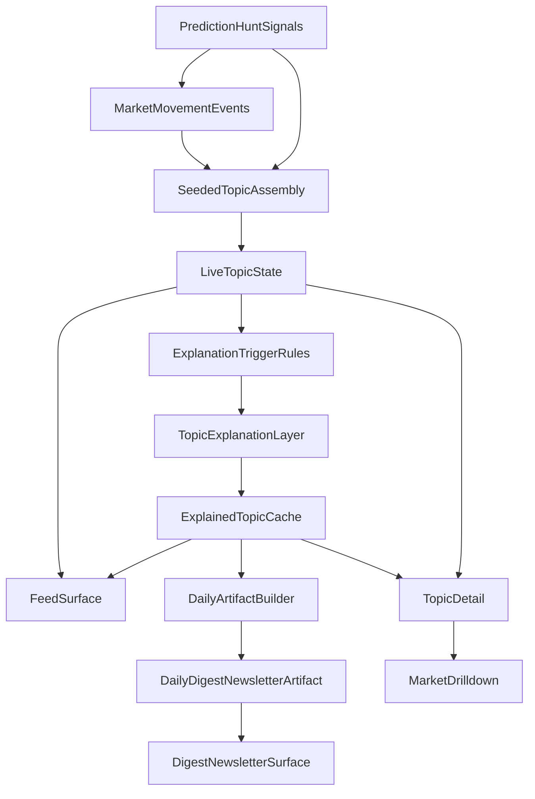

# Pivot V1 Plan

## Recommendation

The best way to execute this pivot quickly is **not** to rebuild the ingestion foundation and **not** to force fully automatic topic intelligence in V1.

The fastest credible path is:

- keep [backend/app/services/prediction_hunt.py](backend/app/services/prediction_hunt.py) and [backend/app/services/markets.py](backend/app/services/markets.py) as the signal foundation
- introduce a new **topic layer** above markets/events
- make the **signal layer** continuous, cheap, and always-on
- make the **intelligence layer** selective, cached, and expensive
- add a dedicated **topic explanation layer** inside that intelligence layer
- use a **hybrid seeded topic model** for coherence and speed
- ship a **live topic feed** as the primary product surface
- derive a **stable daily digest/newsletter artifact** from topic state
- keep market detail pages as supporting drill-downs, not the main IA

This matches your new direction while preserving the existing backend-heavy work that is already useful.

## LLM Workflow Note

For parts of the system that require LLM-driven workflows or pipeline steps, plan to use **LangChain** as the default implementation layer.

That includes likely future work such as:

- topic explanation generation
- explanation refinement or rewrite passes
- selective evidence synthesis
- other bounded intelligence workflows that sit on top of topic state

At this stage, the plan does **not** need to lock in whether those workflows should use plain LangChain, LangGraph, or Deep Agents.

Instead:

- this plan commits only to using **LangChain-family tooling** for LLM-involving core workflows
- the exact choice between plain LangChain, LangGraph, or Deep Agents should be decided inside the detailed plan for each phase
- deterministic signal-layer logic should remain plain service code unless a specific phase clearly benefits from orchestration primitives

This keeps the top-level plan aligned with your implementation preference without prematurely over-specifying orchestration details.

## Why This Path

The codebase already has most of the lower-level plumbing you need:

- [backend/app/services/markets.py](backend/app/services/markets.py) already computes the current market snapshot and lightweight movement events
- [backend/app/models/market.py](backend/app/models/market.py) already has `EntityType.TOPIC`, `Signal`, `MarketEvent`, and summary-friendly shapes
- [backend/app/api/routes.py](backend/app/api/routes.py) already keeps routes thin and service-owned, which matches [docs/phase-gates.md](docs/phase-gates.md)
- Prediction Hunt already gives useful upstream ingredients for topic assembly: markets, events, matching markets, and price history

What is missing is not raw data plumbing. What is missing is an explicit split between a cheap, continuous **signal layer** that maintains topic state and a selective **intelligence layer** that explains only the topics worth deeper synthesis, then derives a **daily artifact** from that explained state.

## Layer Separation

### Signal Layer

This layer should run continuously and stay cheap.

- ingest and normalize market/provider inputs
- derive market movement events
- assemble and update topic state
- keep topics fresh enough to power the live feed
- avoid expensive synthesis by default

### Intelligence Layer

This layer should be selective, cached, and relatively expensive.

- decide which topics deserve explanation
- generate opinionated topic explanations
- cache those explanations so they are reused across feed and digest surfaces
- derive the daily digest/newsletter artifact from explained topic state rather than recomputing everything inline

The key architectural rule is: the feed can be continuously updated from signal-layer topic state, while explanation work only runs when trigger rules say it is worth paying the cost.

## Product Shape

## Preparation Checklist

Before Phase 1 implementation starts, do a small amount of prep work so the pivot is layered cleanly on top of the current plumbing-stage repo rather than forced through market-first assumptions.

### 1. Freeze the current market contract as legacy plumbing

Do not treat the current market/dashboard API as the long-term product contract.

- keep [backend/app/models/market.py](backend/app/models/market.py) and [frontend/lib/market-types.ts](frontend/lib/market-types.ts) stable for existing pages
- do not extend `DashboardSnapshot`, `MarketSummary`, or `MarketEvent` to carry topic/feed concepts
- treat `/api/dashboard`, `/api/markets`, and `/api/markets/{market_id}` as legacy-compatible support surfaces while the new topic layer is introduced

This prevents the pivot from becoming a topic product awkwardly hidden inside market-shaped DTOs.

### 2. Add clean seams before adding new logic

Create separate module boundaries for the new product surface instead of building inside the existing market modules.

- add new backend service areas for topics, explanations, and digest/artifact generation
- add new frontend repository modules for feed/topics/digest rather than routing everything through [frontend/lib/repositories/markets.ts](frontend/lib/repositories/markets.ts)
- keep [backend/app/services/markets.py](backend/app/services/markets.py) as an input/foundation layer, not the home for topic orchestration

This is the minimum structural prep needed to keep the pivot comprehensible.

### 3. Decide the minimum runtime foundation for V1

Before building explained topic state and a daily artifact, explicitly choose the minimum viable operational approach for:

- where explained topic cache lives
- where the stable daily digest/newsletter artifact lives
- how `daily` cutover is defined
- whether V1 feed freshness is backend polling, dynamic fetches, or something more realtime

The repo currently has no durable store, scheduler, or job system, so this should be decided intentionally rather than discovered mid-build.

### 4. Expand config and environment shape early

Current config is still plumbing-stage and minimal.

Before implementation, define the basic configuration surface for:

- topic/feed mode feature flags if needed
- cache behavior and freshness windows
- digest artifact settings
- persistence connection settings if introduced
- any LangChain-related runtime settings later phases may need

This should live in a central settings layer rather than being scattered across services.

### 5. Set a minimum testing and delivery baseline

The pivot introduces parallel product contracts, so add enough safety rails before building:

- backend tests for new topic/feed/digest contracts
- a clear expectation for frontend validation beyond lint/typecheck if topic surfaces become substantial
- basic CI automation for backend tests plus frontend lint/typecheck
- a short runbook or architecture note that explains how live topic state and daily artifacts are supposed to work

This does not need to be heavy, but it should exist before multiple new surfaces are introduced.

### 6. Keep prep intentionally small

Preparation work should stay bounded.

Do:

- create clear seams
- make runtime decisions that unblock implementation
- add enough config/docs/tests to support the pivot

Do not:

- rewrite the existing ingestion or market pipeline
- overbuild infra before the topic/feed model is proven
- try to solve full scheduling, full personalization, or advanced retrieval during prep

## V1 Scope

### 1. Add a new topic-domain contract

Create a parallel domain rather than overloading the current market contract.

Add new backend and frontend types for:

- `Topic`
- `TopicMarket`
- `TopicUpdate` or `TopicShift`
- `DigestItem`
- `DailyDigest`

Key files to extend first:

- [backend/app/models/market.py](backend/app/models/market.py) for any shared primitives you want to reuse
- [frontend/lib/market-types.ts](frontend/lib/market-types.ts) or a new sibling topic types module
- [frontend/lib/repositories/markets.ts](frontend/lib/repositories/markets.ts) or a new [frontend/lib/repositories/digest.ts](frontend/lib/repositories/digest.ts)

Important rule: do **not** break the existing market endpoints yet. Add topic/digest contracts alongside them.

### 2. Build seeded topic assembly above existing signals

Use a **small canonical topic registry** for V1, then allow lightweight expansion around each topic.

Recommended V1 topic strategy:

- define a small set of initial topic seeds such as Fed policy, AI regulation, major geopolitical conflicts, election outlooks, and crypto macro themes
- map markets into those topics using deterministic rules first: market title, provider category, matching-market results, and Prediction Hunt event/search labels
- allow lightweight expansion with query-based discovery from Prediction Hunt `search` and matching-market capabilities, but only inside the seeded topic universe
- attach multiple markets to one topic and score them by relevance and movement magnitude

This gives you coherence immediately while still allowing discovery beyond a rigid hand-curated list.

Best file targets:

- new service area under [backend/app/services/topics/](backend/app/services/topics/)
- [backend/app/services/markets.py](backend/app/services/markets.py) only as an input source, not the home for topic orchestration
- [backend/app/services/prediction_hunt.py](backend/app/services/prediction_hunt.py) for any extra provider calls needed for topic expansion

Constraint for this layer:

- keep the existing ingestion and market pipeline intact and treat topic assembly as a layer **on top of** those inputs, not a refactor of the existing foundation
- optimize this layer for continuous cheap updates suitable for a live feed, not for deep explanation quality

Recommended product role for this layer:

- it powers the **Feed**, which is the live primary UI surface
- it produces topic state that can later be selected for explanation and digest inclusion

### 3. Add a dedicated topic explanation layer

Do **not** bury explanation logic inside digest rendering. Add a separate layer whose explicit job is to turn topic bundles into a clear, synthesized understanding of what is happening.

This layer should:

- produce an opinionated explanation of what changed within the topic
- synthesize across related markets and supporting context rather than restating raw signals
- generate a one-line headline for each topic
- enforce a clarity rule: if a topic cannot be stated cleanly as a one-line headline, split or refine it before it reaches the digest
- be treated as an **intelligence layer** service, not part of the continuous cheap signal path
- cache explanation outputs for reuse across feed, topic detail, and digest/newsletter surfaces

### Trigger rules for topic explanation

Topic explanation should **not** run for every topic update.

It should run only when at least one of these conditions is true:

- the topic crosses a movement threshold large enough to matter
- multiple related markets within the topic confirm the same directional shift
- the topic becomes newly important in recency-adjusted ranking
- the topic has no current explanation or the cached explanation is stale relative to the current topic state
- a manual editorial rebuild is requested for a specific topic or the daily artifact

It should usually **not** run when:

- a topic changed only marginally and remains below the significance threshold
- the update is a small single-market move without confirmation
- the cached explanation still matches the current topic state closely enough for the feed

Design implication:

- signal updates should be able to flow into the live feed without blocking on explanation
- explanation jobs should be idempotent against a topic-state version or hash so cached intelligence can be reused safely

Recommended output for each explained topic:

- `headline`
- `whatChanged`
- `whyNow`
- `supportingSignals`
- `confidenceNotes` or similar optional explanation metadata

Best file targets:

- new explanation service area under [backend/app/services/topics/](backend/app/services/topics/) or a sibling [backend/app/services/explanations/](backend/app/services/explanations/)
- [backend/app/api/routes.py](backend/app/api/routes.py) only for exposing the results, not implementing the synthesis logic

### 4. Replace market-first ranking with topic-first ranking

Right now the home view is effectively:

- take open markets
- derive recent-move events
- sort by absolute movement
- show top events

That is a useful ingredient, but the new ranking unit should be the **topic**, not the event.

Recommended V1 topic ranking signal:

- strongly weight aggregate movement across related markets
- strongly weight multi-market confirmation within the same topic
- strongly weight recency
- treat evidence richness as a secondary signal rather than a primary rank driver
- cap noisy single-market spikes from dominating the digest

This ranking should stay deterministic and inspectable in V1.

### 5. Ship a cached daily digest service

The digest/newsletter should be treated as a **stable daily artifact** built from topic state and explained topic outputs.

Recommended V1 behavior:

- the system materializes one digest/newsletter artifact for the day from current explained topic state
- that artifact remains stable for the rest of the day unless manually rebuilt
- first request of the day may trigger artifact generation if it does not yet exist
- a manual refresh or internal override can rebuild it when needed

This is the right compromise because it:

- avoids introducing cron/persistence complexity too early
- still gives users a stable daily artifact rather than a constantly shifting response payload
- lets you validate digest quality before committing to a more durable storage architecture

Recommended V1 digest structure:

- headline summary for the day
- `3-5` ranked topics is the target range for V1
- per topic:
  - one sharp one-line headline
  - one concise synthesized statement of what changed
  - one concise synthesized explanation of why it likely changed
  - the strongest supporting market movements
  - the strongest supporting sources or provider context

Quality bar:

- fewer high-quality topics is better than broader coverage
- if a topic is not coherent enough to support a crisp headline and explanation, it should be excluded or split before publication
- the digest should read like an intelligence brief, not a widened dashboard

Best file targets:

- new [backend/app/services/digest/](backend/app/services/digest/)
- [backend/app/api/routes.py](backend/app/api/routes.py) for new digest and topic routes

Suggested new endpoints:

- `GET /api/digest/daily`
- `GET /api/topics`
- `GET /api/topics/{topic_id}`
- optional internal `POST /api/internal/digest/rebuild` later, but not required for the first slice

### 6. Make digest the primary product surface

The frontend currently teaches and routes users through a market/event/signal hierarchy from the landing page and header.

That should change first at the product-surface level:

- make the main CTA and primary navigation point to a **Feed** page rather than `/dashboard`
- position the **Feed** as the live topic surface and primary UI
- position the **Digest/newsletter** as the curated daily snapshot built from topic state
- position markets as supporting evidence, not the first object a user sees
- add a topic detail page that groups related markets and updates under one narrative frame
- keep [frontend/app/(main)/markets/[marketId]/page.tsx](frontend/app/(main)/markets/[marketId]/page.tsx) as a secondary drill-down
- keep the internal Prediction Hunt desk hidden as plumbing, not user-facing product

Key files likely to change:

- [frontend/app/page.tsx](frontend/app/page.tsx)
- [frontend/components/site-header.tsx](frontend/components/site-header.tsx)
- new feed route under `frontend/app/(main)/...`
- digest/newsletter route under `frontend/app/(main)/...`
- new topic route under `frontend/app/(main)/topics/[topicId]/page.tsx`
- reuse visual patterns from existing dashboard/event cards where useful, but avoid preserving the old market-first information architecture

### 7. Keep external context narrow in V1

Your product direction clearly wants external evidence, but the current live path only has minimal provider-backed signals.

To build this out fast, V1 should use a staged approach:

- phase 1: Prediction Hunt signals, provider context, matching markets, and movement windows
- phase 2: lightweight external source attachment for only the top ranked digest topics
- phase 3: richer retrieval, topic timelines, and better explanation quality

This avoids spending the whole pivot on broad retrieval infrastructure before the topic model is proven.

## Delivery Order

### Preparation phase

- freeze the current market contract as legacy plumbing
- establish separate topic/feed/digest service and repository seams
- decide the minimum persistence/caching strategy for explained topics and daily artifacts
- expand config/docs/test expectations enough to support the pivot safely

### Phase 1: Topic foundation

- define topic/digest DTOs
- create seeded topic registry and matching rules
- implement topic assembly service from existing market/event inputs
- ensure topic state can update continuously and cheaply enough to back the live feed
- expose `GET /api/topics` and `GET /api/topics/{topic_id}`

### Validation checkpoint

Stop after Preparation plus Phase 1 and verify the foundation before moving on.

- test topic/domain contracts end to end
- test topic assembly quality on a bounded seed set
- verify that new topic routes and repository seams are stable
- confirm the runtime choices made in the preparation phase are sufficient for the next phase
- only then plan and start the explanation layer, digest artifact, and broader product-surface pivot

### Phase 2: Topic explanation layer

- implement explicit topic explanation synthesis after topic assembly
- enforce the one-line headline rule and split/refine unclear topics
- keep explanation outputs opinionated and explanatory rather than signal-summary-shaped
- add trigger rules so explanation runs only for selective high-value topic states
- cache explanation outputs keyed to topic-state versions or equivalent stable inputs

### Phase 3: Digest generation

- implement topic ranking with movement strength, multi-market confirmation, and recency as the primary drivers
- treat evidence richness as secondary
- build digest generation on top of explained topics rather than raw topic bundles
- materialize the daily digest/newsletter as a stable artifact derived from topic state
- expose `GET /api/digest/daily`
- validate output quality on a bounded topic set with a target of `3-5` strong topics

### Phase 4: Product surface pivot

- add feed page as the main route users enter
- add digest/newsletter page as the curated daily snapshot surface
- demote dashboard and markets in navigation
- add topic detail drill-down
- update landing copy from market/event/signal to feed/topic/intelligence/digest

### Phase 5: Targeted enrichment

- attach better evidence for top topics only
- improve explanation quality and support links
- introduce timeline-ready update records behind the topic detail page

## Explicit V1 Non-Goals

Do not let these slow down the pivot:

- fully automatic clustering across the whole market universe
- broad personalization
- many providers beyond Prediction Hunt
- a full interactive timeline UI
- perfect external retrieval coverage
- refactoring the existing ingestion or market pipeline foundations
- replacing every old market-oriented route immediately

## Success Criteria

V1 is successful when:

- the main user experience is a live topic feed, not a market dashboard
- the digest/newsletter behaves like a stable daily artifact derived from topic state
- each digest item is a coherent topic, not a disguised single-market event
- each topic is clear enough to stand as a one-line headline
- users can see what changed, why it likely changed, and what signals support that view
- explanations feel opinionated and synthesized rather than like stitched-together signal summaries
- topic detail pages feel like an evolving narrative bundle, not a list of unrelated markets
- existing market pages still work as supporting drill-downs while the new topic layer takes over the product surface

## Best Immediate Build Sequence

If you want the fastest path to something real, I would execute in this exact order:

1. Do the small preparation phase: freeze legacy market contracts, create new seams, and decide minimum runtime foundations.
2. Add topic/digest backend models and routes.
3. Implement seeded topic assembly over current Prediction Hunt market/event inputs so it can power a live feed cheaply.
4. Stop and validate Preparation plus Phase 1 before proceeding.
5. Add the dedicated topic explanation layer, trigger rules, and headline-clarity rule.
6. Build the stable daily digest/newsletter artifact on top of explained topics.
7. Create a feed page, digest page, and topic page in the frontend.
8. Reposition landing page and navigation.
9. Only then improve evidence retrieval and explanation quality.

That sequence gets the product meaningfully aligned with the pivot as early as possible, instead of spending another cycle deepening a market-first app that is no longer the target.