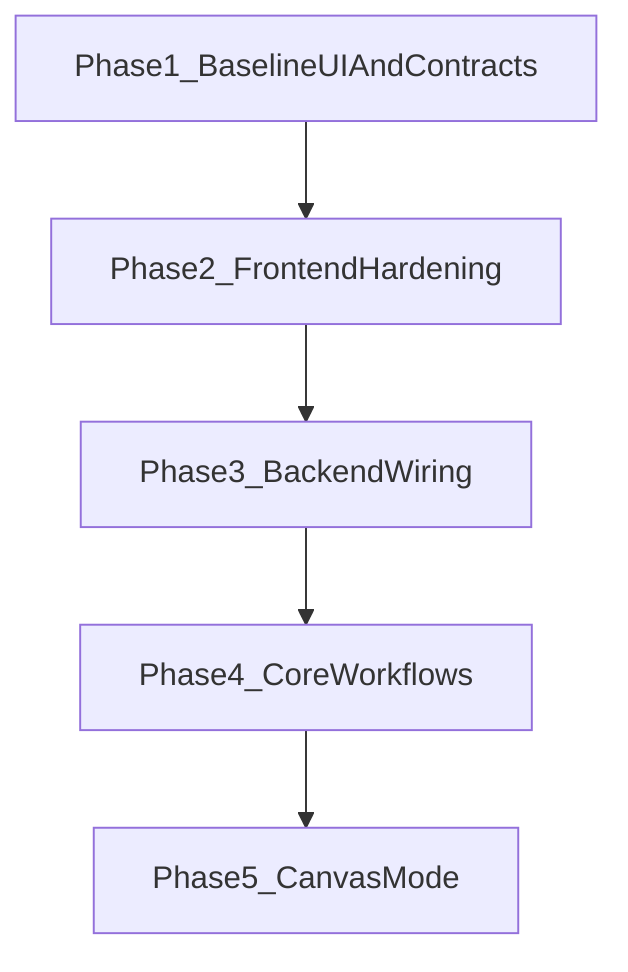

# Development Plan

## Product Direction To Build Around

This should feel like a research workstation, not a trading terminal and not a generic AI dashboard.

Current decision:

- The current UI is good enough to support the next stage of work.
- Default to preserving the present light-mode experience unless a missing workflow or poor usability forces a targeted change.
- Spend the next cycles on functionality, data flow, and system boundaries rather than visual exploration.

Design direction for the first pass:

- Domain concepts: dossiers, annotated timelines, evidence trails, market shifts, watchlists, event windows.
- Color world: paper, graphite, slate, muted ink, one restrained accent for active state/signal emphasis.
- Signature element: the market page should center on an annotated event timeline with inline evidence blocks, so the product’s identity comes from event-oriented reading/exploration rather than KPI cards.
- Reject these defaults: generic dark dashboard, chat-first layout, metric-card overload.

## Phase 1: Lock The Baseline UI And Contracts

Goal: treat the current UI as the approved baseline and make sure the frontend contracts are stable enough for backend wiring.

Planned work:

- Keep the current route structure and page hierarchy as the baseline:
  - `/` as the entry/dashboard surface
  - `/markets` as the browseable gallery with filtering
  - `/markets/[marketId]` as the canonical market workspace
- Keep events inline on the market page for V1; do not add canvas mode yet.
- Stabilize the frontend-only domain layer with mock contracts, for example:
  - `frontend/lib/market-types.ts`
  - `frontend/lib/mock-data.ts`
  - `frontend/lib/selectors.ts`
- Continue using reusable UI pieces around the final hierarchy rather than one-off page code, likely under:
  - `frontend/components/markets/*`
  - `frontend/components/dashboard/*`
- Use dummy data that already mirrors the eventual backend model: `Market`, `MarketEvent`, `Signal`, `Entity`, `RelatedEvent`.
- Fill any remaining state gaps now, even with fake data:
  - loading skeletons
  - empty states
  - error states
  - filter/query states

Exit criteria:

- The current UI remains intact without requiring another design pass.
- The product hierarchy still feels right: dashboard -> gallery -> market -> inline event exploration.
- The dummy data shape is realistic enough that wiring the backend later does not force a UI rewrite.

## Phase 2: Frontend Hardening Before Backend

Goal: make the approved UI resilient enough that real data can slot in without restructuring routes/components.

Planned work:

- Convert page composition into a clear container/presentation split:
  - route/page files own loading and data selection
  - presentational components only render typed props
- Normalize URL state where it matters:
  - gallery filters in search params
  - market event expansion state in route/query/hash form if useful
- Only make targeted responsive or density tweaks where real functionality exposes a usability problem.
- Audit component boundaries for App Router best practices so reusable style helpers stay server-safe and client interactivity stays isolated.

Exit criteria:

- The UI can be driven by either mock data or real API data with minimal component churn.
- The user-facing flows are stable enough to stop revisiting layout structure during backend work.

## Phase 3: Backend And Real Data Wiring

Goal: replace the simulated data layer with a real FastAPI-backed contract.

Planned work:

- Add a new `backend/` FastAPI app with a small initial surface:
  - health endpoint
  - markets list
  - market detail
  - market events for a market
- Start with Kalshi as the first integration, but keep normalization platform-agnostic.
- Define the backend schema around the same UI-first contracts used in Phase 1.
- Introduce a thin frontend API layer that becomes the only data source for pages once stable.
- Remove or heavily reduce frontend mock fallbacks once real endpoints are trustworthy.

Immediate implementation target:

- Get the frontend reading from one normalized markets contract and one market-detail contract before expanding into richer intelligence features.

Suggested backend file targets:

- `backend/app/main.py`
- `backend/app/api/routes.py`
- `backend/app/models/*.py`
- `backend/app/services/kalshi/*.py`
- `backend/app/services/events/*.py`

## Phase 4: Core Workflows

Goal: build the actual value-add engine after the UI and market/event structure are stable.

Planned work order:

1. Market ingestion and normalization.
2. Event detection from price history/time windows.
3. Signal retrieval around detected event windows.
4. Light relevance grouping and entity extraction.
5. Deterministic relatedness using shared entities, sources, and time overlap.
6. Grounded copilot using event data/signals first, external search second, with explicit source labeling.

Important constraint:

- Do not build fancy ranking or opaque similarity early. The first working version should be explainable and inspectable.

## Phase 5: Canvas Mode Last

Goal: add the structured graph only after the canonical market/event flow is trusted.

Planned work:

- Build canvas from the same approved event data model, not from a separate representation.
- Graph structure should stay constrained to:
  - `MarketEvent -> Signals -> Entities`
  - optional related-event links
- Use the market page as the source of truth; canvas is an alternate lens, not a second product.

## Delivery Sequence

## Practical Build Strategy

- Treat the current UI as a frozen-enough product shell, not as an active design sprint.
- Keep the dummy data intentionally close to final contracts so the frontend survives the transition to real APIs.
- Do not let chat/canvas creep into early functionality work.
- Revisit UI only when backend wiring or workflow implementation reveals a concrete need.

## Next Slice To Execute

- Stabilize `frontend/lib/market-types.ts` and related mock data so the backend contract is obvious.
- Harden route/query/loading/error boundaries in the existing pages and components.
- Create `backend/` with a minimal FastAPI app and initial endpoints for health, markets list, and market detail.
- Add a thin frontend API layer that can swap pages from mocks to real responses with minimal component churn.
- Keep UI edits narrow and functional while the data path is being built.

