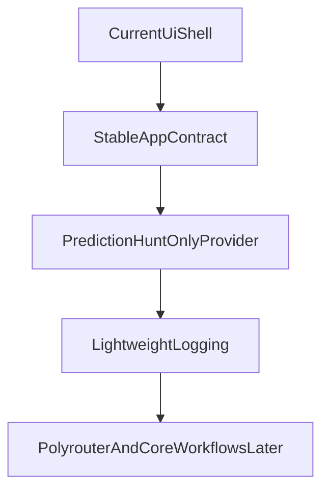

# Superseded

This plan is kept only as historical context.

The active product direction is now topic-centric and lives in [pivot.plan.md](pivot.plan.md).

# Development Plan

## Current Direction

This should still feel like a research workstation, not a trading terminal and not a generic AI dashboard.

The current working assumption is:

- keep the present UI shell
- keep the frontend/backend market contract stable
- use Prediction Hunt as the only active provider during plumbing
- defer Polyrouter composition and deeper intelligence workflows until after the contract and provider cleanup are stable

## Plumbing Stage

During this stage:

- `/`, `/markets`, and `/markets/[marketId]` remain the primary product surfaces
- the backend remains the only app-facing data boundary
- mocks can remain as a fallback, but Dome and Kalshi no longer define the main runtime path
- internal tooling is reduced to the Prediction Hunt desk only

## Next Slice To Execute

- keep the market contract stable in `frontend/lib/market-types.ts` and `backend/app/models/market.py`
- keep `frontend/lib/repositories/markets.ts` as the only frontend path for core market data
- keep `backend/app/services/markets.py` as the thin app-facing mapping layer over Prediction Hunt
- keep UI edits narrow and functional while the provider and backend boundaries are being simplified

